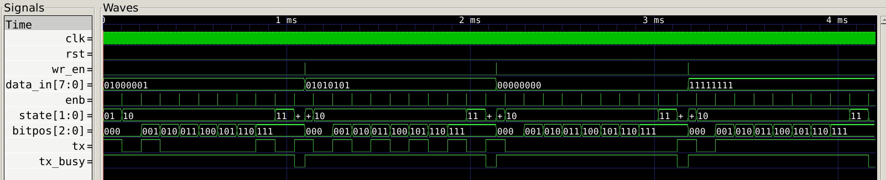
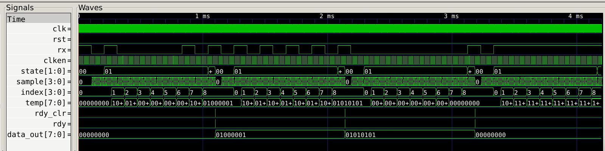
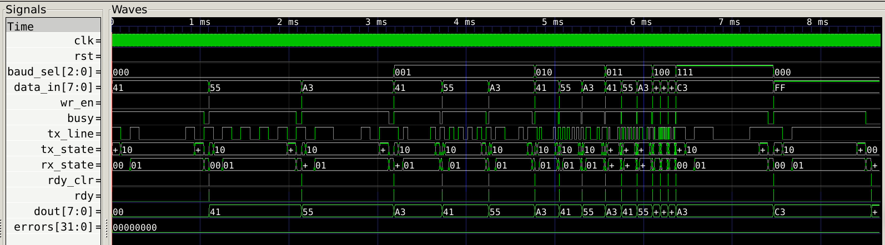
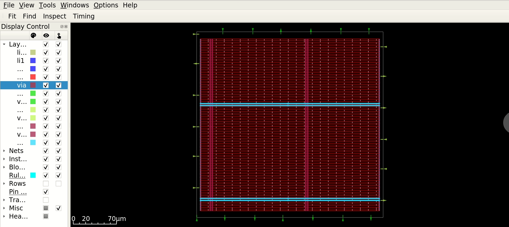
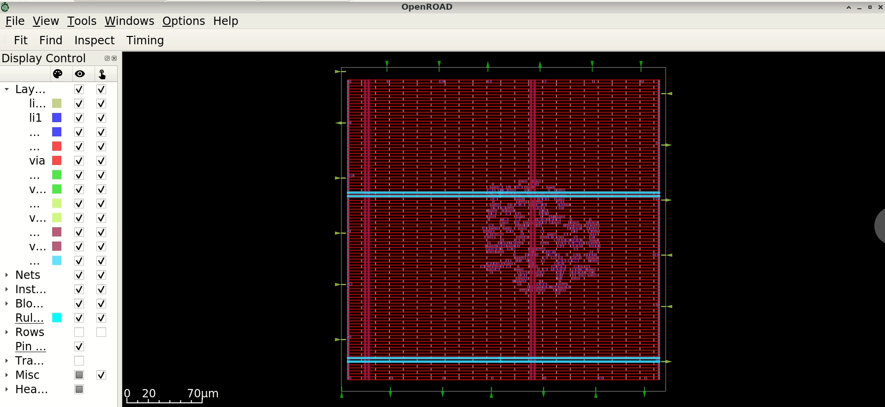
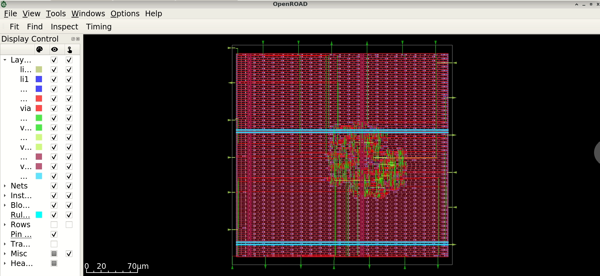
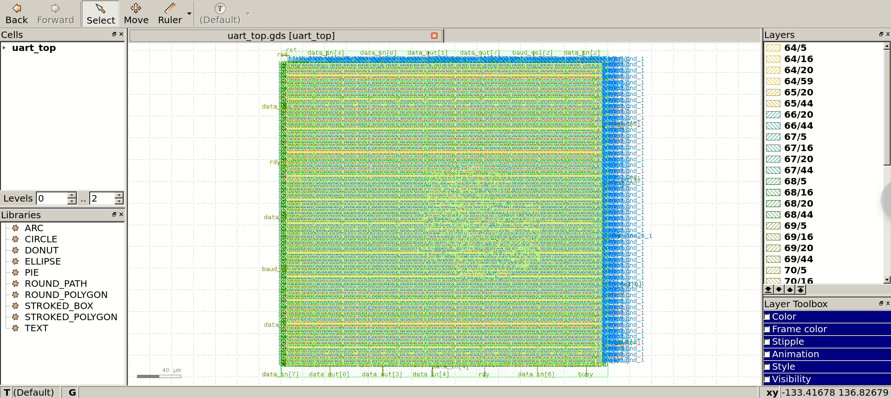

# UART RTL to GDSII

A complete digital design flow for a configurable-baud-rate UART, carried from RTL through gate-level synthesis to a fully placed-and-routed, signed-off GDSII layout on the SkyWater 130nm (sky130A) open-source PDK.

The design implements a UART transmitter, receiver, and a baud rate generator selectable across five standard rates (9600 to 115200 baud), verified in simulation and taken through OpenLane's full physical design flow with a clean DRC, LVS, and antenna signoff.

## Toolchain

| Stage | Tool |
|---|---|
| RTL design | Verilog |
| Functional simulation | Verilator |
| Waveform viewing | GTKWave |
| Logic synthesis | Yosys |
| Standard cell library | SkyWater sky130A (`sky130_fd_sc_hd`) |
| Placement and routing | OpenLane (OpenROAD, Magic, Netgen) |

## Project structure

```
rtl/               Synthesizable Verilog source (baud generator, transmitter, receiver, top)
testbench/         Verilator testbench for uart_top
synthesis/         Standalone Yosys synthesis script, netlist, and area report
openlane/          OpenLane configuration and physical design outputs
  final_artifacts/   Final GDSII, DEF, LEF, SDC, and post-route netlist
  report_artifacts/  Signoff reports: DRC, LVS, antenna, timing, area, metrics
waveforms/         GTKWave captures from functional verification
layout/            Screenshots of the design at each physical design stage
```

## Design overview

**`baud_rate_generator`** derives TX and RX (16x oversampled) tick pulses from a 100 MHz system clock, selectable at runtime via a 3-bit `baud_sel` input across 9600, 19200, 38400, 57600, and 115200 baud. Switching `baud_sel` resets both internal counters so a rate change never produces a short first bit.

**`uart_transmitter`** is a 4-state FSM (IDLE, START, DATA, STOP) that serializes an 8-bit input, LSB first, framed with one start bit and one stop bit.

**`uart_receiver`** is a 3-state FSM (START, DATA, STOP) with 16x oversampling and mid-bit sampling for noise tolerance, and a 2-flop synchronizer on the incoming serial line.

**`uart_top`** instantiates the three blocks in an internal loopback (transmitter output tied to receiver input), used here as a self-contained testable design for the physical design flow.

## Verification

The testbench in `testbench/uart_top_tb.v` drives bytes through the transmitter, across the internal loopback, and checks the received byte against what was sent, at every one of the five baud rates. All bytes were received correctly with zero errors, and the measured `enb_tx`/`enb_rx` tick periods and bit spacing on the serial line matched the expected divisor at each rate.

**Screenshot placement:** `waveforms/` folder. Suggested captures:
- 
**Full multi-baud run showing `baud_sel` stepping through all five rates**
- 
**UART transmitter FSM and tx_line**
- 
**UART receiver FSM and data_out**
- 
**Multi-baud functional run**

## Synthesis

`synthesis/synth.sh` runs a standalone Yosys synthesis pass against the sky130_fd_sc_hd liberty library, independent of OpenLane, to check the design's cell-level structure and area before physical design.

From `synthesis/uart_top_stat.rpt`:

| Metric | Value |
|---|---|
| Cells | 353 |
| Flip-flops (`dfxtp_1`) | 73 |
| Chip area | 2992.87 um^2 |
| Sequential element area | 1461.40 um^2 (48.83%) |

## Physical design (OpenLane)

`openlane/config.json` holds the final configuration used for the signoff run.

```json
{
    "DESIGN_NAME": "uart_top",
    "CLOCK_PORT": "clk",
    "CLOCK_PERIOD": 10,
    "DIE_AREA": "0 0 300 300",
    "PL_TARGET_DENSITY": 0.45,
    "MAX_FANOUT_CONSTRAINT": 70,
    "RUN_HEURISTIC_DIODE_INSERTION": 1
}
```

Two settings above were tuned deliberately based on signoff evidence rather than left at their defaults, and the reasoning is documented here since it reflects a real design tradeoff:

- **`RUN_HEURISTIC_DIODE_INSERTION`** was enabled to resolve antenna rule violations found during an early signoff run, by inserting protective diode cells on the affected nets.
- **`MAX_FANOUT_CONSTRAINT`** was raised from OpenLane's default of 10 to 70. Inserting the antenna diodes added load to already high-fanout nets in the `baud_sel` decode logic (a control signal that inherently drives every rate-select mux across both TX and RX divisor paths), pushing some nets past the default fanout guideline. The default of 10 is a generic conservative heuristic, not a hard electrical limit; the actual electrical limits, `max_cap` and `max_slew`, passed with zero violations throughout, and the worst affected timing path retained over 5 ns of setup slack on a 10 ns clock. The constraint was raised to comfortably clear the highest fanout actually produced by the design, and no further, rather than relaxed arbitrarily.

### Signoff results

From `openlane/report_artifacts/manufacturability.rpt`, `metrics.csv`, and `33-rcx_sta.checks.rpt`:

| Check | Result |
|---|---|
| Magic DRC violations | 0 |
| LVS | Clean, 472/472 nets matched, 0 errors |
| Antenna pin violations | 0 |
| Antenna net violations | 0 |
| Max fanout violations | 0 |
| Max slew violations | 0 |
| Max cap violations | 0 |
| Worst negative slack (WNS) | 0.0 ns (met) |
| Total negative slack (TNS) | 0.0 ns (met) |
| Critical path delay | 2.85 ns (against a 10 ns / 100 MHz clock) |

**Area and utilization**

| Metric | Value |
|---|---|
| Die area | 0.09 mm^2 |
| Core utilization target | 50% |
| Placement density target | 45% |
| Total cells (post-route, incl. fill/tap/decap/diode) | 8557 |
| Diode cells inserted | 124 |
| Fill cells | 1224 |
| Well-tap cells | 1144 |
| Decap cells | 5610 |

**Routing**

| Metric | Value |
|---|---|
| Total wire length | 12342 um |
| Vias | 3192 |
| Routing distribution | Metal 2: 4.46%, Metal 3: 4.33%, Metal 4: 0.28%, Metal 5: 0.73% |

**Power (typical corner, estimated)**

| Component | Value |
|---|---|
| Internal power | 0.543 nW |
| Switching power | 0.187 nW |
| Leakage power | 0.00674 nW |

**Screenshot placement:** `layout/` folder, in flow order:

**Floorplan**

**Placement**

**Routing**

**Final GDSII layout**

## Reproducing the flow

```bash
# 1. Simulate the RTL
cd testbench
verilator --binary --timing --trace-fst -Wno-fatal --top-module uart_top_tb \
  ../rtl/*.v uart_top_tb.v
./obj_dir/Vuart_top_tb
gtkwave uart_top_tb.fst

# 2. Standalone Yosys synthesis check
cd ../synthesis
sh synth.sh uart_top <path-to-sky130_fd_sc_hd-liberty-file> 10 ../rtl/*.v

# 3. Full physical design with OpenLane
cd /openlane
cp -r <this repo>/openlane/config.json designs/uart_top/
cp <this repo>/rtl/*.v designs/uart_top/src/
openlane designs/uart_top/config.json
```

## Notes

- `synthesis/uart_top_netlist.v` is the pre-physical-design logical netlist from the standalone Yosys pass. `openlane/final_artifacts/uart_top.v` is the final post-route netlist that corresponds to the GDSII output, including CTS buffering, fill/tap/decap cells, and antenna diodes; the two are kept separate as they represent different stages of the flow.
